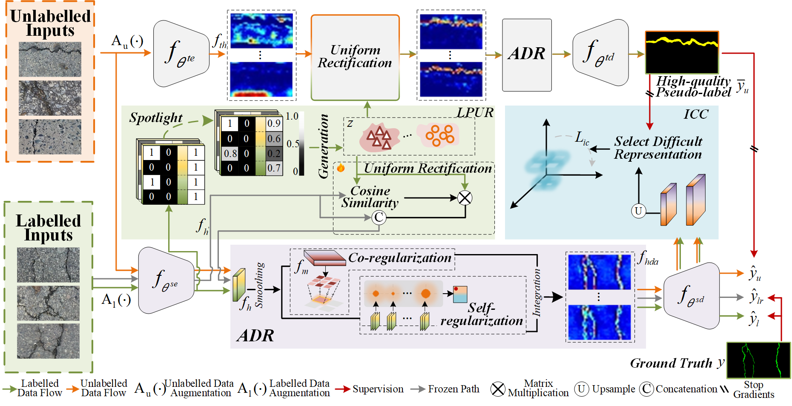

# <p align=center>`Limited Label-Support Pavement Damage Segmentation Network with Uniform Rectification and Intrinsic Cross-Dimensional Constraint`</p>

<p align="center">
     <br />
    <em> 
    The structure of the proposed network
    </em>
</p>

## 1、🌟  Datasets & Checkpoints & Test results 

The pavement defect datasets, along with the checkpoints and test results of our method, can be accessed via the following links:

| Dataset | Partition protocol | Checkpoints & Test results |
|-------|-------| -  |
| Crack500 | [GoogleDrive](https://drive.google.com/drive/folders/1UUrhhteZS7DppAnk8FvMN2BED112soh0?usp=sharing) | , [GoogleDrive](https://drive.google.com/drive/folders/1zf36hd-Ppoox6whf81IW45MOIqkLJ7KV?usp=sharing) |
|IPSS |[GoogleDrive](https://drive.google.com/drive/folders/1LrK6_yiYzBReWctseBZzCtJch_avb5ie?usp=sharing) | [GoogleDrive](https://drive.google.com/drive/folders/1PZwxZ4wauj2ic25v8QqY1k7_gUOjwH3O?usp=sharing) |


## 2. 🚀 Get Start

**1. Download Datasets**
Download the datasets from the links above and place them in the 'data' folder.

**2. Train & Test.**

Train and test on the Crack500 dataset 
```
bash crack.sh
```
Train and test on the IPSS dataset 
```
bash gf.sh
```

After training and testing, the checkpoints and test results will be saved in the path `saved'.

> We invite all to contribute to making it more accessible and useful. If you have any questions or suggestions about our work, feel free to contact me via e-mail (wangyanyan_neu@163.com). 

## Reference
You may want to cite:
```
@article{yan2025limited,
  title={Limited label-support pavement damage segmentation network with uniform rectification and intrinsic cross-dimensional constraint},
  author={Yan, Yunhui and Wang, Yanyan and Song, Kechen and Ma, Shuai and Huang, Liming and Cui, Wenqi},
  journal={Advanced Engineering Informatics},
  volume={67},
  pages={103536},
  year={2025},
  publisher={Elsevier}
}

```

## License

Code in this repo is for non-commercial use only.


